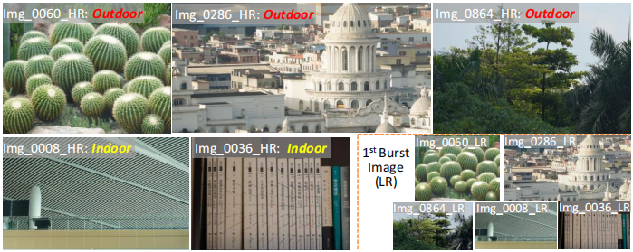
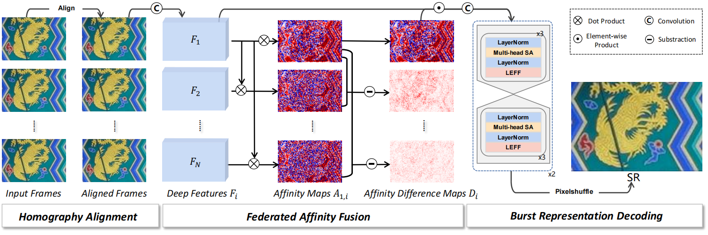

# Towards Real-World Burst Image Super-Resolution: Benchmark and Method 
This is the official implementation of ICCV2023 "Towards Real-World Burst Image Super-Resolution: Benchmark and Method".

Here is the [[baidu link]](https://pan.baidu.com/s/1xVsCXPDK8bLTHZJNr_ygWQ?pwd=1m2e) (include RealBSR-RGB) and the [[google drive link]](https://drive.google.com/drive/folders/1d4FOmRs0cKxWLPCsH-x7apVfsRJMKSJ4?usp=sharing) (include RealBSR-RGB and RealBSR-RAW) of the proposed RealBSR dataset. 


<hr>
<i> In short, we propose a new real-world dataset named RealBSR for real-world burst super-resolution, and also propose a corresponding network to fully explore the details provided by sub-pixel information.



## Package dependencies
The project is built with PyTorch 1.10.1, Python3.9, CUDA10.1. For package dependencies, you can install them by:
```bash
pip3 install -r requirements.txt
```

## Pretrained model

- Checkpoint of FBANet on RealBSR dataset [[Google Drive]](https://drive.google.com/file/d/1Gc-xp_MAi6_rLTfEAT9N50ERgbfz3b4A/view?usp=drive_link).

|               Model                |  PSNR  | SSIM  | LPIPS |
|:----------------------------------:|:------:|:-----:|:-----:|
|       FBANet (FAF in paper)        | 31.012 | 0.898 | 0.102 |

## Data preparation 
### Alignment
For training and testing data of Burst, first you should align the burst frames using homography_alignment.py
```python
python homography_alignment.py
```
The aligned frames could be put into '../LR_aligned' and then you should use the **aligned frames** as the input of the following training and testing.


## Evaluation
If you want to use your own data, the resolution of data should better >=160x160, and the setting could be changed in ManualDataset.py and test_in_any_resolution.py.

For convenient evaluation, you could use data [[here]](https://drive.google.com/file/d/1I9WZCB8MGEc4MJe_WJXhx50AakbK15aL/view?usp=sharing) for evaluation.
It is worth noting that the data is not included in training or testing of our BaseModel.

### test for arbitrary resolution

```python
python homography_alignment.py
python test_in_any_resolution.py --arch BaseModel --weights ./checkpoints/FAF/model_best.pth --save_images
```


## Training
### Base Model
To train BaseModel on RealBSR, we use 2 V100 GPUs and run for 200 epochs:

```python
python3 ./train.py --arch BaseModel --batch_size 16 --gpu '0,1' --train_ps 160 --env 64_0523_MotionMFSR_FAF --embed_dim 64 --warmup
```

